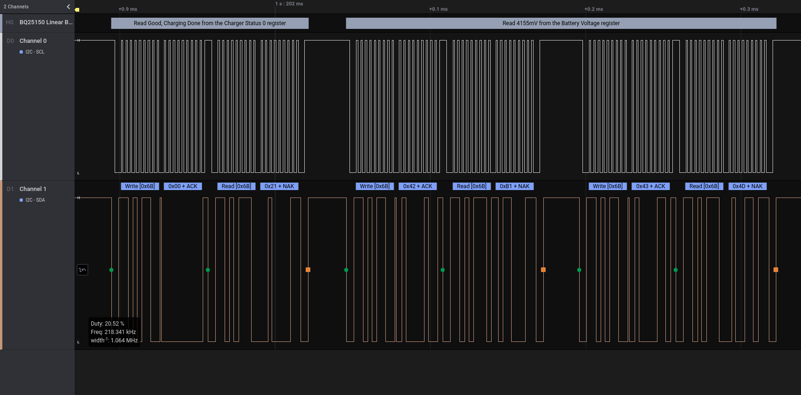

# BQ25150 Linear Battery Charger for Logic 2

This is a high level analyzer plugin for Saleae Logic 2 that describes in words what information is going back and forth on the I2C line of a TI BQ251XX linear battery charger.

